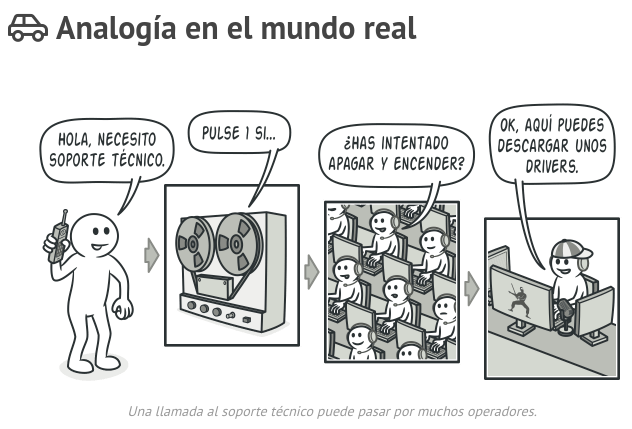
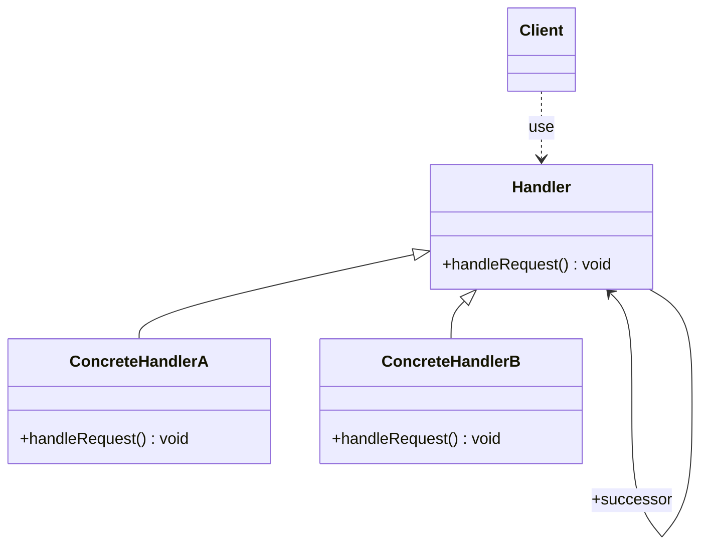

# Chain Of Responsibility
Este patron nos permite pasar solicitudes a lo largo de una cadena de manejadores. Al recibir una solicitud, cada manejador decide si la procesa o si la pasa al siguiente manejador en la cadena. Esto nos permite desacoplar el codigo que envia una peticion del codigo que la procesa.
Tipicamente el codigo que quiere que una peticion sea manejada llama a un metodo exacto en un objeto exacto para que la procese. La cadena de responsabilidad soluciona este problema dando a mas de un objeto la chance de procesar el pedido.
Para lograr esto creamos objetos encadenados de forma tal que cada objeto conoce la referencia al objeto siguiente en la cadena. Le hacemos la peticion al primero en la cadena, si este no puede manejarla, simplemente la pasa al siguiente en la cadena.
Un efecto secundario de este patron es que no tenemos garantia de que la peticion sera manejada.

## Aplicabilidad
Este patron es muy util cuando:
* El programa debe procesar distintos tipos de solicitudes de varias maneras, pero los tipos exactos de solicitudes y sus secuencias no se conocen de antemano. El patron nos permite encadenar varios manjeadores y, al recibir una solicitud “preguntar” a cada manejador si puede procesarla.
* Cuando sea fundamental ejecutar varios manejadores en un orden especifico ya que podemos vincular los manejadores de la cadena en cualquier orden y este sera respetado por todas las solicitudes.
* Cuando sea necesario cambiar en tiempo de ejecucion el grupo de manjeadores y su orden. Podemos insertar, eliminar o reordenar los manjeadores de forma dinamica mediante setters.

## Diagrama

El cliente es el encargado de pasar la solicitud al primer objeto de la cadena
El handler define la interfaz para manejar las solicitudes y opcionalmente implementa el link al sucesor.
Las implementaciones de la interfaz Handler (ConcreteHandler) manejan si pueden la solicitud, si no pueden la pasan al sucesor.
A modo de resumen, el cliente envia la peticion al primer handler en la cadena, luego la peticion se mantendra viajando por la cadena hasta que de con un handler capaz de manejarla.

## Implementacion
Empezamos definiendo el handler en una interfaz o clase abstracta
* El handler debe definir un metodo para aceptar las solicitudes entrantes
* El handler puede definir un metodo para acceder al sucesor en la cadena. Si fuera una clase abstracta podriamos incluso almacenar al sucesor.

Luego implementamos el handler en una o mas de sus implementaciones. Las implementaciones deberian chequear si pueden manejar la solicitud. Si no pueden, deberia pasarla al sucesor en la cadena.

Debemos crear nuestra cadena de objetos. Tipicamente este trabajo es realizado por un framework o por codigo de inicializacion escrito por el desarrollador.

El cliente solo necesita conocer el primer objeto de la cadena y le pasara la solicitud a este objeto.

### Algunas consideraciones de implementacion
* Es preferible implementar el Handler como interfaz, ya que esto permite que cualquier clase la implemente y actue como un handler. Esto permite usar tus clases existentes, las cuales tal vez ya extienden de alguna clase en la aplicacion, como implementacion de un handler.
* Los handlers pueden pemritir a la solicitud propagarse incluso aunque la manejen. Esto es que incluso cuando un handler realice determinadas acciones sobre una solicitud, existen casos en que la solicitud deberia continuar propagandose. Un ejemplo seria en las cadenas de servlet filter que permiten a la solicitud fluir al siguiente filtro incluso aunque hayan realizado acciones sobre ella.
* La cadena puede ser descrita usando XML o JSON de manera que se podria agregar o remover handlers de la cadena sin modificar codigo.
* Algunas veces se puede considerar usar conexiones existentes o cadenas. Por ejemplo, si estuviste usando el patron composite ya dispones de una cadena la cual puede ser usada para implementar este comportamiento.

## Pros y contras
|   Pros   |   Contras   |
|----------|-------------|
|Se puede controlar el orden de procesamiento de las solicitudes.|Algunas solicitudes podrian acabar sin ser procesdas.|
|Single Responsibility Principle: Podemos desacoplar las clases que invocan las operaciones de las que las procesan.| |
|Open Closed Principle: Podemos introducir nuevos manejadores en la aplicacion sin descomponer el codigo cliente existente.| |

## Ejemplos en JDK
* java.util.logging.Logger#log()
* javax.servlet.Filter#doFilter()
