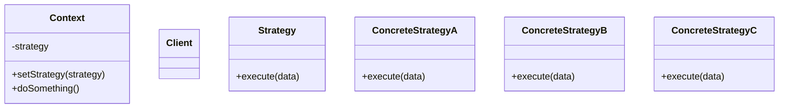

# Strategy

## Aplicabilidad

## Diagrama

```mermaid

classDiagram

class Context
Context: -strategy
Context: +setStrategy(strategy)
Context: +doSomething()

class Client

class Strategy
Strategy: +execute(data)

class ConcreteStrategyA
ConcreteStrategyA: +execute(data)

class ConcreteStrategyB
ConcreteStrategyB: +execute(data)

class ConcreteStrategyC
ConcreteStrategyC: +execute(data)
```

## Implementacion

### Consideraciones sobre la implementacion

## Ventajas y desventajas
## Ejemplos en JDK

